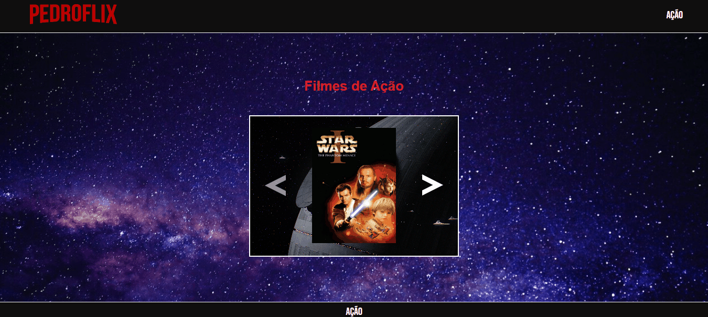

# Projeto: Movie Slider
Uma landing page se espelhando em um modelo de streaming.
Onde estarão carrosseis com imagens de filmes, em seus respectivos gêneros.
 
 

## Projeto

 
 

## Objetivos
Fazer uma landing page, se inspirando nas páginas de streaming. Onde se terão sections para cada gênero de fime escolhido, e dentro se tendo um carrossel de imagens dos filmes deste mesmo gênero.   
Além de fazer esse site ser responsivo.
 
 

## Tecnologias Ultilizadas
- HTML
- CSS
- JS
 
 

## Métodos
Foi usado display grip juntamente com display flex, para melhor agrupamento e controle das seções da Landing Page e suas tags.
 
 

## Desafios
Conseguir fazer com que todos os carrosseis de imagens funcionem, alem de ativar e desativar as setas quando necessário, tudo isso com JavaScript.  
Solução: ??.  
Conseguir deixar a landing page de uma forma responsiva e de qualidade para os principais tamanhos de tela.
