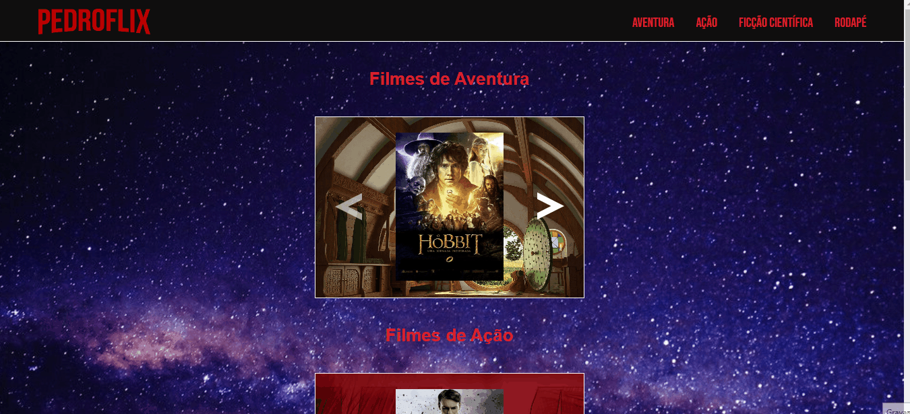

# Projeto: Movie Slider
Uma landing page se espelhando em um modelo de streaming.
Onde estarão carrosseis com imagens de filmes, em seus respectivos gêneros.
 
 

## Projeto

 

## Objetivos
Fazer uma landing page, se inspirando nas páginas de streaming. Onde se terão sections para cada gênero de fime escolhido, e dentro se tendo um carrossel de imagens dos filmes deste mesmo gênero.   
Além de fazer esse site ser responsivo.
 
 

## Tecnologias Ultilizadas
- HTML
- CSS
- JS
 

## Métodos
Foi usado display grid juntamente com display flex, para um melhor agrupamento e controle das seções da Landing Page e suas tags.
Para o JavaScript foi-se criado um array com os endereços das imagens, as quais são chamadas em uma das funções criadas.
 
 

## Desafios
Conseguir fazer com que todos os carrosseis de imagens funcionem, alem de ativar e desativar as setas quando necessário, tudo isso com JavaScript. 
  
Solução: Colocar em um array os caminhos para as imagens, e criar uma função para colocar esses caminhos no src da tag img do HTML. Além de criar outras funções para esconder e mostrar as setas, e a background image quando e se necessário. 
  
Conseguir criar funções "genericas" e colocar em um arquivo .js apenas para as elas, e chamar no arquivo .js oficial.
  
Solução: Se ultilizar de parâmetros com nomes simples, porém bem autoexplicativos e quando chamados as variáveis "cairão como uma luva".
  
Conseguir deixar a landing page de uma forma responsiva e de qualidade para os principais tamanhos de tela.
